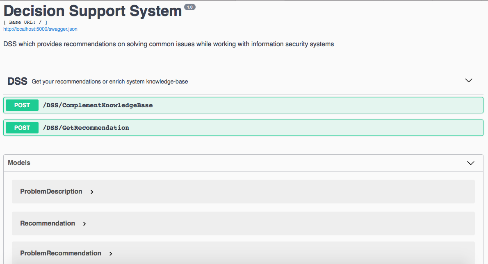

# Decision Support System

Basic structure implemented. There're three API methods:
1. /GetRecommendation: gets problem description in log or stdout text format
and returns recommendations sorted by relevance (rating).  
2. /RateRecommendation: gets problem, recommendation and "did helped" flag
and tunes problem->recommendation rating (compliance rate).  
3. /AddRecommendation: gets recommendation and saves it to knowledge base.  

API documentation is powered by OpenAPI Swagger.  


## Flask app

Database connectors: `sqlite3` and
[mysql-connector-python](https://dev.mysql.com/doc/connector-python/en/connector-python-example-cursor-select.html) 

[click](https://click.palletsprojects.com/en/7.x/) for command line interface
 
## docker-compose
 
Start 4 containers
1. `nginx`
2. `elastic`
3. `mysql`
4. `app` - Flask app starts with uwsgi and 30 sec delay for completely start elasticsearch.
Without delay elasticsearch is not started properly and flask app crashes with multiple errors.

`mysql` and `app` use common environment file `mysql.env` for
container variables.

## Scripts

`app_flask_cmd.sh` - script to execute flask commands in app container

```bash
# shell in app
docker-compose exec app bash
# list available flask command
docker-compose exec app flask --help
./app_flask_cmd.sh --help
# migrate to last migration
./app_flask_cmd.sh db migrate
# current database migration version
./app_flask_cmd.sh db version
# update elastic cache from database
./app_flask_cmd.sh elastic-refresh
```

```bash
# access to mysql shell
docker-compose exec mysql mysql -pmysqlroot
```

## Cold start

```bash
docker-compose up
# wait 30 sec until it starts
./app_flask_cmd.sh db migrate
./app_flask_cmd.sh elastic-refresh
```

## Evaluation

DSS accuracy was evaluated according with the following metric:  
every GetRecommendation result (5 sorted recommendations) was rated with coefficient counted as ```(5 - n + 1)/5```
where n is position of recommendation in returned list (zero is the top one). Finally, all counted coefficient were averaged
 (divided by their amount).    
 
Final system accuracy coefficient is *0,37*.    

Described metric uses only one recommendation from list (the one which was useful)
and takes its position in the list into account. According to this 0,37 is not that small because it can mean that
 useful recommendation was returned almost always but it could be in not in the first position. 
